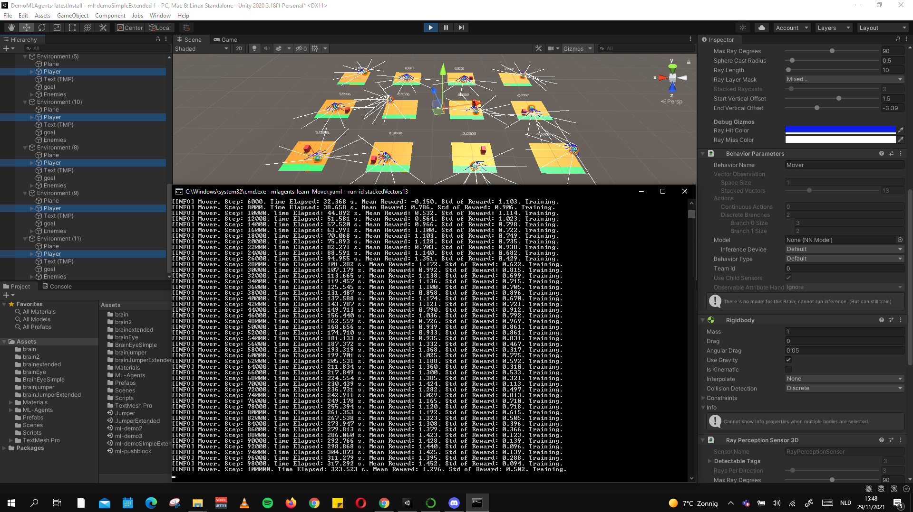

# ML_Agents_deel2 - Nabil El Moussaoui

## S-nummer
Nabil El Moussaoui
S-nummer is: `s109431`

## Het willekeurig getal dat de generator genereerde
Het willekeurig getal dat de generator genereerde is: `01`
- Het geheugen van de obervatievector via _Stacked Vectors_ in de _Behavior Parameters_-component

## Welke variabele heb je veranderd?
Het geheugen van de obervatievector via _Stacked Vectors_ in de _Behavior Parameters_-component

## Welke waarden heb je voor deze variabelen gekozen?
Ik heb de waarden 02, 13, 24, 35 en 46 gekozen, omdat ze allemaal een interval hebben van 11.
De variabele kan je van 01 tot 50 instellen.

## Welke waarden horen bij welke run-ids?
#### Waarden:
- Stacked Vectors: `02` hoort bij `mlagents-learn Mover.yaml --run-id stackedVectors02`
- Stacked Vectors: `13` hoort bij `mlagents-learn Mover.yaml --run-id stackedVectors13`
- Stacked Vectors: `24` hoort bij `mlagents-learn Mover.yaml --run-id stackedVectors24`
- Stacked Vectors: `35` hoort bij `mlagents-learn Mover.yaml --run-id stackedVectors35`
- Stacked Vectors: `46` hoort bij `mlagents-learn Mover.yaml --run-id stackedVectors46`

Deze worden uitgevoerd op 12 Environments Duplicates

#### Extra waarden:
- Stacked Vectors: `02` hoort bij `mlagents-learn Mover.yaml --run-id m01`
- Stacked Vectors: `13` hoort bij `mlagents-learn Mover.yaml --run-id m02`
- Stacked Vectors: `24` hoort bij `mlagents-learn Mover.yaml --run-id m03`
- Stacked Vectors: `35` hoort bij `mlagents-learn Mover.yaml --run-id m04`
- Stacked Vectors: `46` hoort bij `mlagents-learn Mover.yaml --run-id m05`

Deze worden uitgevoerd op 1 Environment

## Screenshot van grafiek met voor elke run-id de curve met geaccumuleerde beloningen
#### Waarden:

#### Extra waarden:

#### Conclusie
De Stacked Vectors geeft het aantal toestanden die worden gestacked en worden doorgegeven naar het neurale netwerk. Het trainen van de mlagents op die verschillende variabelen (02, 13, 24, 35 en 46) verschillen wel bij de `Extra waarden` of `Stacked Vectors die op één Environment zijn uitgevoerd` (m01, m02, m03, m04 en m05).

## Enkele screenshots:

